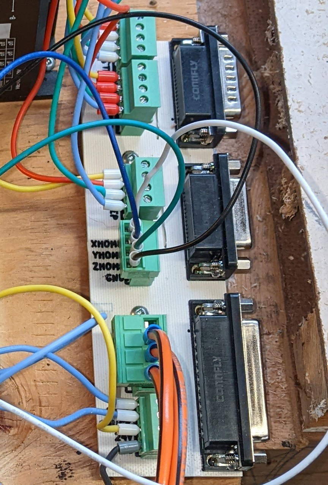

# bunGrbl-Breakout

This is a Kicad breakout board for an older Bungard CCD (ATC in this case,
but it should work with manual change spindles) PCB mill. That's the
version with the DB-25 and male/female DB-15's. It's intended to be used
with a [GRBL](https://github.com/gnea/grbl/wiki) controller of some sort.

At the moment I'm running my machine with a custom ATMega328P GRBL
controller (Uno/Nano equivalent), DM542 stepper drivers, a JYQD-V8.5E bldc
motor driver, and a Meanwell LRS 350-24 PSU. The spindle maxes out around
35k RPM with that motor driver, but otherwise everything works fine.

To release the pneumatic collet, the CHUCK signal should be pulled to GND
by a switch.

X,Y,Z limit switches are wired NC. The tool length switch is NO, and
I've gone and split that off into a connector for performing the usual
auto-leveling.

I've milled my board single sided as there's only a couple of jumpers
needed.

